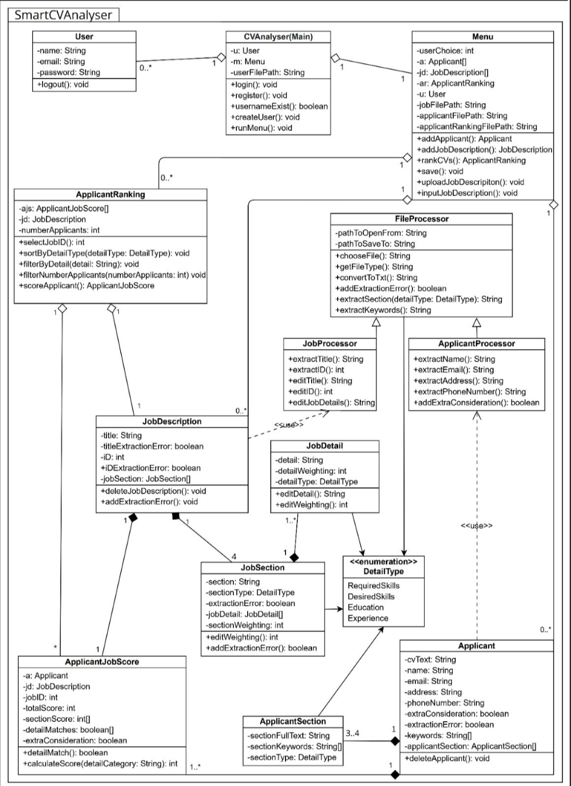

# Smart CV Analyzer

## SID: 2408078

## Introduction

The project outlined below is part of my 1st year Software Principles module assessment at Anglia Ruskin University.
This is my first project in Java as well as my first introduction to the Object-Oriented Programming style.

## Background

Recruitment teams face the challenge of manually screening hundreds of resumes, a process that is both time-consuming
and prone to errors. This project aims to develop a **Smart CV Analyzer** that automates this process by leveraging
Natural Language Processing (NLP) to jobDescriptionNLP resumes, extract relevant skills and experience, and match them
to job requirements.

**NLP Basics:**

* Begin by understanding how NLP identifies entities, such as recognizing "Python" as a skill.
* Utilize beginner-friendly NLP tools like spaCy.

**Problem Scope:**

* Initially, focus on structured resumes (e.g., PDFs with clear headings) to simplify parsing.

## Summary

This project involves researching and designing a Smart Resume Analyzer system to automate resume screening. You will
explore tools and techniques for extracting relevant information from resumes and matching them to job requirements.
You'll need to clearly define the requirements, assumptions, and decisions involved in this process.

**Key Objectives:**

* Design a system to automate resume screening.
* Extract key details (skills, education, experience) from resumes.
* Rank candidates based on their match to job descriptions.

**MVP Approach:**

* Start with a Minimal Viable Product (MVP) using basic keyword matching.
* Progress to more advanced NLP models.
* The system does not require a Graphical User Interface (GUI).

**Objective:**

This project focuses on designing an automated system to solve real-world challenges in recruitment. It emphasizes
critical thinking, data processing, and optimization to improve hiring workflows.

## Deliverables

**Artifact:**

* A prototype application (or wireframes) demonstrating the following features:
    * Resume upload (PDF/DOCX/TXT).
    * Job description input (text field).
    * Ranked candidate list.

**Prototype:**

* A simple application with:
    * User interaction for uploading resumes and entering job descriptions.
    * Key features:
        * Extracting resume details.
        * Matching candidates to requirements.
        * Ranking results.

## Requirements

**Data Input:**

* Allow users to upload resumes in formats like PDF, DOCX, or TXT.
* Provide a text field or upload option for job descriptions.

**Resume Parsing:**

* Extract structured information from resumes, including:
    * Name and contact details.
    * Skills and technical proficiencies.
    * Work experience and job titles.
    * Education qualifications.
* Tip: Use regex for basic phone/email extraction.

**Matching & Ranking:**

* Use NLP techniques to match extracted resume details to job requirements.
* Assign scores or ranks to resumes based on relevance.

**Result Display:**

* Display a ranked list of resumes with key highlights, such as matched skills or experience.
* Include filtering options based on criteria like skills, experience, or education.

## Suggestions

**Tools Selection:**

* Use spaCy or OpenNLP for named entity recognition and key phrase extraction.
* Libraries like PyPDF2 or Apache Tika can handle document parsing for PDFs and DOCX files.

**Dataset:**

* Use publicly available resume datasets or generate synthetic resumes for testing.
* Collect example job descriptions for matching experiments.

**Scalability:**

* Design the system to handle bulk resume uploads and job descriptions efficiently.

## Challenges

* Handling variations in resume formatting.
* Ensuring accurate matching of skills and experience to job descriptions.

**Strategies:**

* **Formatting Variations:** Start with resumes using standard headings (e.g., "Work Experience").
* **Ambiguous Terms:** Map synonyms (e.g., "ML" = "Machine Learning") using a glossary.

## Package and Class Overview
| Package                  | Class Name                   | Description                                                                  |
|--------------------------|------------------------------|------------------------------------------------------------------------------|
| `main`                   | `Main`                       | The entry point for the program                                              |
| `main`                   | `User`                       | Handles the user login and register as well as storing the username          | 
| `UI`                     | `JobDescription`             | The UI for uploading the job description                                     |
| `UI`                     | `Login`                      | The UI for the login                                                         |
| `UI`                     | `Menu`                       | The menu UI                                                                  |
| `UI`                     | `Register`                   | The UI for register                                                          |
| `NLP`                    | `JobDescriptionNLP`          | Uses NLP to parse the job description                                        |
| `records`                | `CVRecord`                   | Stores the data from the CV                                                  |
| `records`                | `JobDescriptionRecord`       | Stores the data from the Job description, parsed using `JobDescriptionNLP`   |
| `util`                   | `FileExtractor`              | Extracts data from files and saves to `.txt` file                            |
| `util`                   | `KeyboardReader`             | Utility function that takes user inputs                                      |
| `util`                   | `FileSaver`                  | Saves file to chosen dir                                                     |
| `auth`                   | `LoginAuth`                  | Handles the logic for the login                                              |
| `auth`                   | `RegisterAuth`               | Handles the logic for register                                               |
| `actions.loggedIn`       | `JobDescriptionUploadAction` | Implements `UserAction`. Calls `upload()` from `JobDescription`              | 
| `actions.loggedIn`       | `ShowJobDescriptionAction`   | Implements `UserAction`. Calls `showJobDescription` from `JobDescription`    |
| `actions.loggedIn`       | `UserLogoutAction`           | Implements `UserAction`. Calls `logout()` from `User`                        |
| `actions.loggedOut`      | `UserLoginAction`            | Implements `UserAction`. Calls `login()` from `User`                         |
| `actions.loggedOut`      | `UserRegisterAction`         | Implements `UserAction`. Calls `register()` from `User`                      |
| `actions.jobDescription` | `SaveToNewFileAction`        | Implements `UserAction`. Calls `saveToNewFile()` from `FileSaver`            |
| `actions.jobDescription` | `SaveUnknownFileTypeAction`  | Implements `UserAction`. Calls `saveUnkownFileType()` from `FileSaver`       |
| `Interface`              | `UserAction`                 | An interface that can return any data type and has an empty execute() method |

## Project Adaptations and Modifications

### Class Diagram Adaptations and Modifications


Above it the class diagram that was created in the planning stage of the project. I have not followed it and I will
detail why below. 

#### Interfaces 

So one of the most obvious changes is the addition of an interface class ``UserAction`` along with a group of action classes
split into a few packages (```actions.loggedin```, ```actions.loggedOut```, ```action.jobDescription```).
These are used in the various menus within the project. ```UserAction``` defines a method ```execute()```. The action functions
implement ```UserAction``` to call functions in other classes in the project, for example ```login()``` in the ```User``` class.
This in OOP concept called polymorphism. There are a few benefits to doing it this way instead of using switch statements. One benfit is 
it is modular and easy to extend. All you need to do is create a new Action class write what you would like to do within the ```execute()```
function and then add that to the hash map. 

While this may sound overkill for short menu's, which to an extent it is, it makes it easier to extend. If in the future, the project 
required a menu with 10 options, the switch statement would be very long and thus hard to read and maintain. I have even used ```UserAction``` 
for a menu that only has two options, the reason I have done this is because this project if for Track Genesis. In the future they may want to 
add more functionality to the program which could mean adding more menu options, this avoids the aforementioned long switch statements. 